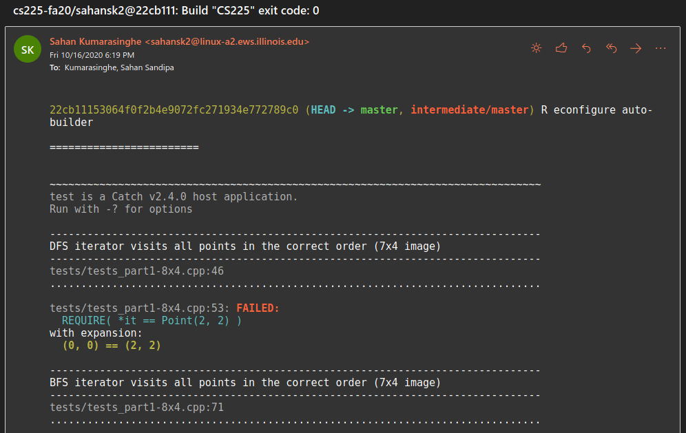

# EWS Test-runner

For testing your code on UIUC's EWS without ssh'ing into it all the time.

This code will send you an email whenever your code is done building. This is a very bare-bones lightweight solution to needing to run your code remotely.

Because this runs on EWS, most of the programs this uses don't have to be installed manually. The only additional program you need is [Aha](https://github.com/theZiz/aha), which is used to convert build output into nice HTML that you can read. The install script will automatically install this for you from source.

## Installation instructions

Installation is only available for macOS users (not tested), Linux users with Bash/zsh, or Windows users with Git Bash (not tested).

First, clone this repository:

```sh
git clone https://github.com/sahansk2/ews-tester.git
```

Then, `cd` into it and make necessary changes to `install.sh`. The instructions should be self-evident. If not, please open up a GitHub issue.
This is designed to work on your personal computer (NOT the remote).

After you are done customizing your install, run `install.sh` by running:

```sh
bash ./install.sh
```

Once you have a successful install, download and copy the files in `worktree-repo` (`ews-tester.sh`, `job_ews-tester.sh`) to the root of 
the repo on your personal machine on which you actually want to do testing. Here is what my `cs296` repo looks like:

```
cs296-25-fa20
├── a_bmoore
├── a_bwt
├── a_fmi
├── a_naive
├── a_narytree
├── a_pigeon
├── a_sarray
├── a_stree
├── a_zalg
├── ews-tester.sh <------
├── job_ews-tester.sh <------
└── README.md
```

Add these files and commit, and you're done! You will 99% of the time never need to touch `ews-tester.sh`. You can control the actual commands you execute by specifying `job_ews-tester.sh`. A useful template has already been provided here.

These instructions should be clear enough for you to get going. Enjoy a life of no longer having to ssh into EWS every time you want to run tests!